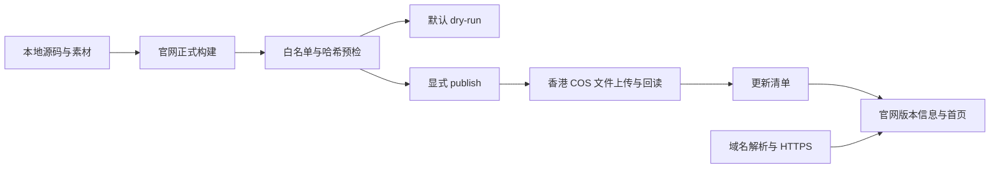

# 官网部署到香港 COS

这份说明供维护者使用。梓神只需要打开官网，选择安装版或便携版。维护者已确认购买 `azusa510.top`，已退掉此前的大陆容量包。中国香港存储桶 `azusa510-1500305922` 已创建，APPID 为 `1500305922`；公开对象读取策略与静态网站均已保存，自定义源站域名 `azusa510.top` 已添加。DNS 记录已保存并实测生效，匿名目录列举已实测返回 HTTP 403。用户截图确认域名已上线、CNAME 检查通过、源站类型为静态网站，证书已绑定，控制台显示的本地到期时间为 2027 年 1 月 2 日 18：59：59。维护者已开启域名页与静态网站页的「强制 HTTPS」，实测 HTTP 返回 301 并转到同域名 HTTPS。

严格直连 TLS 与 HTTPS `HEAD` 已实测通过：连接已认证、证书验证无错误，证书 `CN=azusa510.top`，到期时间为 UTC 2027 年 1 月 2 日 10：59：59，与控制台显示的北京时间一致。上传前空桶首页返回 404；正式上传后首页与公开文件正常读取。官网 32 个静态及下载资源的完整大小和 SHA-256 均匹配，另外四个更新源文件通过真实 COS 完整／差量更新验收。视频分段请求返回 206，浏览器实际播放正常，两个正式软件下载入口均可用。具体证据见 [官网验证记录](../validation/site-v071-check-result.json) 与 [Windows 更新记录](../validation/windows-v071-check-result.json)。[域名及证书生效说明](https://cloud.tencent.com/document/product/436/36638)

采用香港 COS 静态托管，不启用 CDN、全球加速或独立服务器。官网、演示、下载和更新文件来自同一存储桶，配置、密钥和本机弹幕服务仍留在使用者电脑上。



## 第一次准备账号和域名

1. 账号实名认证已经完成，不用再做一次。域名实名认证是另一项流程，需要先建立审核通过的信息模板；身份资料只在腾讯云提交，不放进项目。官方指引见 [单个域名注册](https://cloud.tencent.com/document/product/242/9595) 和 [域名实名认证](https://cloud.tencent.com/document/product/242/6707)。
2. 查询候选域名的注册状态、首年价格和续费价格，再确定购买哪一个。`.top` 与 `.cn` 都可用于这份香港方案；首年折扣和后续年费可能不同。名字可以带 `azusa`、`510` 等元素，但最终以注册查询结果为准；如果已被注册，先重新确定名字，不购买其他拼写，也不自行改正式域名。查询入口为 [腾讯云域名价格](https://buy.cloud.tencent.com/domain/price)。
3. 只在自己核对订单金额后完成购买。域名是按年续费，首年优惠不代表以后同价。开启到期提醒；是否自动续费由你决定。
4. 香港直连方案不接入中国大陆 CDN。腾讯云的自定义源站教程明确：绑定到**中国大陆地域存储桶**的域名才必须完成网站备案；中国香港列在香港及境外地域中。因此这里采用香港桶，不要求先办理大陆网站备案。域名实名认证仍需完成；如果以后换为大陆托管或大陆 CDN，需要重新按对应要求办理，不能直接沿用本配置。[存储桶切换自定义域名](https://cloud.tencent.com/document/product/436/102509)、[地域与访问域名](https://cloud.tencent.com/document/product/436/6224)、[实名、备案与账号认证的区别](https://cloud.tencent.com/document/faq/242/8580)

域名、香港桶、公开读取策略、静态网站、自定义源站域名与部署子账号均已配置，正式文件已上传，DNS、严格 HTTPS、HTTP 跳转与实际下载已通过。后续更新沿用下方构建和发布流程。不需要追加服务器套餐、付费 DNS 或付费 SSL，免费证书需要定期维护。

## 建立香港存储桶

在 [COS 控制台](https://console.cloud.tencent.com/cos5) 创建一个专门放官网的普通存储桶。

- 地域选**中国香港**，地域代号为 `ap-hongkong`，不能选广州、上海等其他地域。当前确认的完整桶名为 `azusa510-1500305922`；桶名末尾的 `1500305922` 是 APPID，后续脚本填写完整桶名。[地域与访问域名](https://cloud.tencent.com/document/product/436/6224)
- 使用标准存储及单 AZ 即可，创建时访问权限选**私有读写**。随后用下一节的桶策略开放公开文件的读取，不开放目录列举与写入。桶里只放正式公开资源，个人配置、导入图片和密钥不进入这个桶。
- 不开启 CDN、全球加速、跨地域复制或图片处理等附加功能。不要给匿名用户写权限，也不授权公开列举对象列表。
- 此部署脚本要求桶**从未启用版本控制**。COS 在启用或暂停版本控制后，不再保证禁止覆盖头部有效；脚本会检查并停止，不能靠关闭检查继续上传。[禁止覆盖说明](https://intl.cloud.tencent.com/zh/document/product/436/7749)
- 开启静态网站，索引文档填 `index.html`。本项目是静态多页面，不需要把所有 404 都重写成首页；不存在的地址应正常返回 404。[静态网站说明](https://www.tencentcloud.com/document/product/436/30958)

创建弹窗点击「确定」后，返回「存储桶列表」，确认看到 `azusa510-1500305922`，且地域为「中国香港」。只有看到列表中的实际存储桶，才能继续以下设置；若创建失败，先处理控制台提示，不重复创建其他地域的桶。

## 开放网站读取，保留目录与写入权限

存储桶 ACL 的「公有读私有写」会把 `READ` 授给匿名用户，而桶级 `READ` 同时包含列出与读取对象，不能用它保证目录不公开。本项目保留私有桶 ACL，使用范围更明确的 Policy。[ACL 访问控制实践](https://cloud.tencent.com/document/product/436/12470)

### 当前桶的设置步骤

1. 在桶列表点击 `azusa510-1500305922`，进入**权限管理 → 存储桶访问权限**，确认公共权限仍是「私有读写」。不要改为桶级「公有读私有写」。
2. 进入**权限管理 → Policy 权限设置 → 策略语法**，点击「编辑」。当前桶没有其他策略时，将下面已经填好 APPID 与桶名的内容粘贴进去；若已有策略，不要整段覆盖，先核对并合并。
3. 点击「保存」。若出现公开访问提醒，核对操作只有 `GetObject` 与 `HeadObject`，没有写入或列举权限，再确认保存。

以下内容仅适用于当前的 `azusa510-1500305922` 中国香港桶：

```json
{
  "version": "2.0",
  "statement": [
    {
      "effect": "allow",
      "principal": {
        "qcs": ["qcs::cam::anyone:anyone"]
      },
      "action": ["name/cos:GetObject", "name/cos:HeadObject"],
      "resource": ["qcs::cos:ap-hongkong:uid/1500305922:azusa510-1500305922/*"]
    }
  ]
}
```

### 后续换桶时的通用模板

保留下面模板供后续维护。将 `【APPID】` 替换为新桶名末尾的数字，将 `【完整桶名】` 替换为带数字后缀的实际桶名；不含密钥，但不能保留占位文字直接保存。

```json
{
  "version": "2.0",
  "statement": [
    {
      "effect": "allow",
      "principal": {
        "qcs": ["qcs::cam::anyone:anyone"]
      },
      "action": ["name/cos:GetObject", "name/cos:HeadObject"],
      "resource": ["qcs::cos:ap-hongkong:uid/【APPID】:【完整桶名】/*"]
    }
  ]
}
```

它仅允许匿名读取文件和查询文件元数据，未授权 `GetBucket`、上传、删除或修改配置。`GetObject` 与 `HeadObject` 是不同操作，必须分别列出。静态网站由维护者在控制台开启，访客无需获得网站配置管理权限。[存储桶策略](https://intl.cloud.tencent.com/zh/document/product/436/45235)、[COS API 授权策略](https://intl.cloud.tencent.com/zh/document/product/436/30580)

如果使用图形设置，选择「所有用户，可匿名访问」，效力为「允许」，资源范围为整个桶内的对象，仅添加「下载对象／GetObject」与「查询对象元数据／HeadObject」。不要勾选「列出对象列表／GetBucket」或「所有操作」。保存后核对生成的策略与上面两项操作一致。

脚本不会自动修改 ACL 或 Policy，避免误改已有权限。上线验收时需要同时确认：匿名下载和 `HEAD` 返回成功，未签名访问桶默认对象域名的列表请求返回拒绝。只检查官网首页能打开还不够。

当前已实测确认：对 `https://azusa510-1500305922.cos.ap-hongkong.myqcloud.com/?list-type=2` 发起匿名 `GET`，返回 HTTP 403，目录列举被拒绝。桶内尚未上传对象，公开对象的 `GET`／`HEAD` 仍需在上传后单独验收，不能用目录拒绝结果代替文件读取验证。

## 开启静态网站

读取策略保存后，在同一存储桶中继续设置：

1. 进入**基础配置 → 静态网站**，在「静态网站」区域点击「编辑」，将当前状态设为「开启」。
2. 索引文档填 `index.html`，注意全小写。不配置错误文档、错误码重定向或前缀重定向；「忽略 html 扩展名」暂时不启用。
3. 自定义域名的证书还没绑定时，先不开启「强制 HTTPS」。完成下一节的域名解析与证书绑定后再开启，避免跳转到无法验证的地址。
4. 点击「保存」，确认页面显示静态网站已开启、索引文档为 `index.html`。随后才去绑定「静态网站源站」类型的自定义域名。

这一入口的操作来自 [设置静态网站](https://cloud.tencent.com/document/product/436/32670)。官方教程的简易公共 ACL 方案会同时允许目录读取，本项目改用前一节的两项对象读取策略；静态网站访问节点本身仅处理 `GET`／`HEAD Object`。没有上传首页时，访问返回错误并不代表配置失败，等正式文件上传与域名绑定完成后再验收。

## 域名解析和 HTTPS

### 第一步：添加官网域名

1. 打开存储桶 `azusa510-1500305922`，进入**域名与传输管理 → 自定义源站域名**，点击「添加域名」。不要进入「自定义 CDN 加速域名」。
2. 域名填写 `azusa510.top`，只填域名，不加 `https://`，也不加末尾的 `/`。源站类型选择「静态网站源站」。
3. 「强制 HTTPS」先保持关闭，证书绑定成功后再开启。按当前页面提示保存域名配置。
4. 添加时或添加成功后，复制控制台显示的 **CNAME** 值，保留这份准确值，下一步直接粘贴。当前控制台给出的实际值为 `azusa510-1500305922.cos-website.ap-hongkong.myqcloud.com`，仅适用于这次已确认的中国香港静态网站源站配置，不是所有地域或其他桶的通用地址。以后换桶、地域或源站类型时重新复制控制台值，不能按旧值猜测，也不要使用 CDN 域名。

如果控制台提示需要先完成解析，就使用该页面已显示的 CNAME 完成下一步，再回来保存；如果没有显示 CNAME，不要自行拼出地址，先核对控制台提示。

### 第二步：在 DNSPod 添加解析

打开 [云解析 DNS 控制台](https://console.cloud.tencent.com/cns)，找到 `azusa510.top`，进入它的记录列表，点击「添加记录」，按下表填写。

| 配置项 | 当前填写内容 |
| --- | --- |
| 主机记录 | `@`，代表不带 `www` 的 `azusa510.top` |
| 记录类型 | `CNAME` |
| 线路类型 | `默认` |
| 记录值 | `azusa510-1500305922.cos-website.ap-hongkong.myqcloud.com`，与这次 COS 控制台复制的值一致 |
| TTL | 保留页面默认值 |

确认后保存。记录值只填 CNAME 域名，不加 `http://`、`https://` 或文件路径。已有同主机记录时先核对用途，不直接覆盖；当前官网先只使用根域名，无需另外添加 `www`。若以后决定支持 `www`，需另外绑定域名、配置解析和匹配的证书，不能只添加一个不存在的跳转。

当前已通过公开 DNS 查询实测确认，`azusa510.top` 的 CNAME 指向 `azusa510-1500305922.cos-website.ap-hongkong.myqcloud.com`，这一步已经生效，无需重复添加或修改。后续维护或换桶时，记录值仍需以当时控制台复制的实际 CNAME 为准，其他记录项按目标域名核对。

解析不是立即生效。保存后回到 COS 自定义源站域名列表，核对解析状态；控制台显示生效后再做实际访问验收。正式配置的 `baseUrl` 与发布后的访问域名保持一致，当前目标为 `https://azusa510.top`。[自定义域名与解析步骤](https://cloud.tencent.com/document/product/436/102509)

### 第三步：绑定 HTTPS 证书

维护者已确认免费 SSL 证书签发并绑定成功，截图显示域名上线、CNAME 检查通过、静态网站源站与证书到期时间，无需重复绑定。等待生效后，严格直连 TLS 与 HTTPS `HEAD` 已验证通过，证书覆盖 `azusa510.top`，没有忽略证书错误。首页暂时返回 HTTP 404，因为正式文件还没上传。

维护者已在**域名与传输管理 → 自定义源站域名**中，编辑 `azusa510.top` 所在行，开启「强制 HTTPS」并保存。当前等待生效，再确认 `http://azusa510.top` 自动跳转到同域名的 HTTPS 地址；这一跳转尚未实测通过。不要修改已经生效的 CNAME 或重复申请证书。

以后更换证书时，打开同一域名行的「绑定证书」，选择「已托管证书」，选择覆盖 `azusa510.top` 的新证书，再保存并重新验收。配置可能需要约 30 分钟生效，绑定成功的提示不能代替实际 TLS 检查。

腾讯云当前文档说明，所有 COS 地域都支持给自定义源站域名托管 HTTPS 证书，因此香港方案无需另买服务器做反向代理。申请匹配正式域名的证书，完成域名验证后在 COS 中绑定，再开启强制 HTTPS。等待解析和证书绑定生效，以实际浏览器结果为准。[自定义源站域名与证书绑定](https://cloud.tencent.com/document/product/436/36638)

可以先使用腾讯云免费证书，其当前有效期为 90 天。启用到期提醒，在到期前申请新证书并重新绑定；续期不是给旧证书延长日期。证书托管能辅助更新，但每次都要确认 COS 实际绑定的证书已换新，不能只看到签发成功就认为网站已经续期。[免费证书说明](https://cloud.tencent.com/document/product/400/89868)、[免费证书续期](https://cloud.tencent.com/document/product/400/61353)

## 本地配置与构建

官网默认配置为 `site/config.json`，个人覆盖保存在 `site/config.local.json`。将正式 `baseUrl` 设为实际买下并配置好的 HTTPS 域名。部署脚本接受上述两种候选域名及各自的 `www` 子域名；候选名单不代表域名已经注册、配置或可访问。这只是构建设置，不会创建域名、申请证书或上传网站。

正式构建前完成本版的软件包和视频制作，然后在项目目录运行：

```powershell
node scripts/build-site.mjs --release
python scripts/deploy-cos.py
```

第二条命令默认仅做本地预检，**不读取云端凭据、不连接腾讯云、不上传文件**。它核对 `dist/site/site-manifest.json` 的白名单、大小和 SHA-256，并显示计划上传顺序。预览构建可以预检，但不能正式发布。

正式构建需包含本版安装向导、便携 ZIP、演示及字幕，以及 `updates/releases.win.json` 引用的全部完整／差量包。当前版本必须有完整更新包。占位域名、未就绪下载、未引用更新包、丢失文件和清单外文件都会停止发布。

发布白名单不包含 `site/config.local.json`、本地背景原目录、`public/temp`、`.env.local`、个人数据、日志或本地助手文件。选择的背景会转换成构建中的独立公开素材，其原始个人配置不会上传。

## 凭据与正式上传

### 第一次上传，先准备专用部署子账号

以下操作由维护者在自己的腾讯云账号中完成。部署子账号只供本机脚本上传官网，梓神的电脑不需要腾讯云账号、密钥或 SDK，也不需要购买任何新产品。

1. 打开 [访问管理 CAM 控制台](https://console.cloud.tencent.com/cam)，进入**策略 → 新建自定义策略 → 按策略语法创建**，选择「空白模板」，点击「下一步」。策略名称填 `Azusa510WebsitePublish`，策略内容粘贴下面的 JSON，核对后完成创建。若页面使用新版可视化生成器，切换到「JSON」编辑，填写相同内容；不要选择包含全部管理权限的系统模板。[按策略语法创建](https://cloud.tencent.com/document/product/598/80789)、[新版策略生成器](https://cloud.tencent.com/document/product/598/37739)
2. 进入**用户 → 用户列表 → 新建用户 → 自定义创建**，类型选「可访问资源并接收消息」，点击「下一步」。用户名填 `azusa510-publish`，访问方式只选「编程访问」，不选「腾讯云控制台访问」；消息信息按页面要求填写。完成页面要求的身份验证。[创建子用户](https://cloud.tencent.com/document/product/598/13674)、[编程访问与控制台访问的区别](https://cloud.tencent.com/document/product/598/10592)
3. 在权限步骤搜索并勾选自己刚建的 `Azusa510WebsitePublish`，不要关联 `AdministratorAccess`、`QcloudCOSFullAccess` 或其他权限更广的用户组。标签可跳过，核对后点击「完成」。如果创建时未关联策略，回到用户列表，点击这个用户的「授权」，搜索并仅关联上述策略。[关联策略](https://cloud.tencent.com/document/product/598/10602)
4. 若成功页已经提供这位子用户的 `SecretId` 和 `SecretKey`，在本机妥善保存，不再新建另一份。若没有提供，点击用户列表中的 `azusa510-publish`，进入**API 密钥 → 新建密钥**。`SecretKey` 只在创建时展示，按页面要求确认已保存。不要把密钥、含密钥截图或导出的凭据文件发到聊天，也不要放进项目目录。[子账号密钥管理](https://cloud.tencent.com/document/product/598/37140)

这是绑定部署子用户的身份策略，与前面匿名访客的桶策略分别保存，不要把它粘贴到桶的公开读取策略里。它只允许读取这个香港桶的地域和版本控制状态，以及上传、回读和查询其对象元数据：

```json
{
  "version": "2.0",
  "statement": [
    {
      "effect": "allow",
      "action": [
        "name/cos:GetBucketLocation",
        "name/cos:GetBucketVersioning"
      ],
      "resource": [
        "qcs::cos:ap-hongkong:uid/1500305922:azusa510-1500305922/*"
      ]
    },
    {
      "effect": "allow",
      "action": [
        "name/cos:PutObject",
        "name/cos:GetObject",
        "name/cos:HeadObject"
      ],
      "resource": [
        "qcs::cos:ap-hongkong:uid/1500305922:azusa510-1500305922/*"
      ]
    }
  ]
}
```

两段都使用官方指定桶资源格式，末尾保留 `/*`；桶级 API 的授权资源也按此格式填写，不能改成不带后缀的桶名。动作分别对应查询地域、查询版本控制及对象上传／回读／元数据查询，不含创建桶、列举目录、改权限或删除操作。[COS API 授权资源格式](https://intl.cloud.tencent.com/document/product/436/30580?lang=en)、[查询桶地域](https://cloud.tencent.com/document/product/436/8275)、[查询版本控制](https://cloud.tencent.com/document/api/436/19888)

### 在本机输入密钥并发布

等正式构建和本地预检通过后再发布。当前维护电脑已准备隔离 SDK 和安全输入脚本，第一次上传按以下步骤即可：

1. 在 Windows 开始菜单搜索并打开「PowerShell」，不需要管理员身份。先把工作目录切到项目，示例路径需替换为自己的源码目录：

   ```powershell
   Set-Location -LiteralPath 'D:\AzusaHexPick'
   ```

2. 先运行预检命令。这一步不要求密钥，不连接云端，也不会上传；看到预检通过后，再继续下一步。若提示正式构建尚未就绪，先完成构建，不跳过检查。

   ```powershell
   & .\scripts\publish-site.ps1
   ```

3. 正式发布命令如下。脚本会先重复预检并核验 SDK，然后才提示输入部署子用户的 `SecretId` 和 `SecretKey`。分别在自己的 PowerShell 中输入或粘贴，每次按回车确认。输入处不会显示明文，也不要把这两项填进命令本身。

   ```powershell
   & .\scripts\publish-site.ps1 -Publish
   ```

4. 等脚本上传并完成回读校验，保留成功或通用失败提示即可；不发送任何密钥。如果失败，按提示处理后重新运行，不删除远端文件或关闭校验。脚本退出时会恢复本次临时环境，密钥不会保存到项目中。

脚本使用带 BOM 的 UTF-8 编码，已通过 Windows PowerShell 5.1 的语法检查和正式文件预检；编辑含中文的 `.ps1` 文件时应保留该编码。脚本自动优先使用 `.runtime/tools/py-build/Scripts/python.exe` 和 `.runtime/tools/cos-sdk/`，不会自动安装软件，也不会新增付费产品。缺少运行环境时按提示补齐，不把 SDK 放入给梓神的安装包。第一次在其他维护电脑发布时，可以安装官方 SDK：

```powershell
python -m pip install cos-python-sdk-v5==1.9.44
```

SDK 安装与环境变量的方式来自 [腾讯云 Python SDK 指引](https://cloud.tencent.com/document/product/436/12269)。本版固定验证 `1.9.44`，维护者可先运行 `python -m unittest discover -s tests -p test_cos_deploy.py`，确认真实 SDK 离线请求检查没有跳过。凭据不进源码、配置文件、网页或安装包。

发布脚本从当前进程的 `COS_SECRET_ID`、`COS_SECRET_KEY` 和 `COS_BUCKET` 环境变量读取配置；使用临时凭据时还需 `COS_SESSION_TOKEN`。不要把凭据发到聊天，不要在命令中直接写明文密钥。

下面是通用维护示例，使用安全输入，输入的值不会作为命令行历史或输出显示。桶名不是密钥，已填为当前香港桶。函数仅设置当前 PowerShell 进程，不写入项目文件；结束时清理密钥。当前隔离 SDK 需要通过 `PYTHONPATH` 告知脚本，操作结束后恢复原值。

```powershell
Set-Location -LiteralPath 'D:\AzusaHexPick'
function Set-CosSessionSecret($name, $prompt) {
    $cosSecureInput = Read-Host $prompt -AsSecureString
    $cosSecurePointer = [Runtime.InteropServices.Marshal]::SecureStringToBSTR($cosSecureInput)
    try {
        [Environment]::SetEnvironmentVariable($name,
            [Runtime.InteropServices.Marshal]::PtrToStringBSTR($cosSecurePointer), 'Process')
    } finally {
        [Runtime.InteropServices.Marshal]::ZeroFreeBSTR($cosSecurePointer)
    }
}
$cosPreviousPythonPath = $env:PYTHONPATH
try {
    $env:PYTHONPATH = Join-Path (Get-Location) '.runtime/tools/cos-sdk'
    Set-CosSessionSecret 'COS_SECRET_ID' '输入部署用 SecretId'
    Set-CosSessionSecret 'COS_SECRET_KEY' '输入部署用 SecretKey'
    $env:COS_BUCKET = 'azusa510-1500305922'
    python scripts/deploy-cos.py --publish
} finally {
    Remove-Item Env:COS_SECRET_ID, Env:COS_SECRET_KEY, Env:COS_SESSION_TOKEN, Env:COS_BUCKET -ErrorAction SilentlyContinue
    $env:PYTHONPATH = $cosPreviousPythonPath
}
```

上传按依赖顺序执行：先处理安装版、便携版和完整／差量包，回读远端内容核验实际大小及 SHA-256；全部通过后才更新 feed，最后更新 `release.json` 和 `index.html`。元数据里的哈希不代替实际回读。

同名正式软件包和更新包视为不可变。远端已有相同文件时核验后复用；内容不同则停止，不覆盖，也不删除。新包携带 COS 禁止覆盖头部，避免并发发布覆盖旧包。当前包低于 2 GB，采用官方 SDK 简单上传并启用 MD5 传输检查，上传后另做 SHA-256 回读。[上传接口](https://cloud.tencent.com/document/product/436/65820)

官方参数文档对 `Metadata` 的说明与当前 SDK 源码存在差异：`1.9.44` 的 `mapped()` 实际原样展开这些键，因此本版通过它传入真正的 `x-cos-forbid-overwrite` 专用头，而不是 `x-cos-meta-forbid-overwrite` 元数据。脚本初始化会先在本地核验映射契约；不符合时停止，不继续上传。真实 SDK 离线检查还会截取完成 MD5 和签名后的 HTTP 请求，确认该头确实存在并参与签名。它不会使用真实密钥或连接腾讯云，不能替代实际桶的防覆盖验收。[官方 SDK 映射源码](https://github.com/tencentyun/cos-python-sdk-v5/blob/master/qcloud_cos/cos_comm.py)、[官方上传源码](https://github.com/tencentyun/cos-python-sdk-v5/blob/master/qcloud_cos/cos_client.py)

SDK 失败时只显示通用错误，不输出原始异常、签名和凭据。发布中断后旧 feed 和首页在对应步骤完成前保持原有入口；已经上传的新包可以在下次核验后继续使用。脚本分别检查远端官网版本与更新 feed 的最高稳定版本，不能用旧版重试覆盖已经写入的新版 feed；提交 feed 前还会再检查一次。不要同时运行两个发布过程。脚本从不批量删除对象，远端历史版本需要保留给跨版本更新。

## 上线后怎么检查

关闭代理后，用电脑 Wi-Fi 和手机流量分别打开正式官网。检查首页、图片、视频播放、安装包和便携包的完整下载；对下载文件核对正式发布的 SHA-256，再做安装和解压验证。仅下载到一部分不能算通过。

确认官网的两个下载入口都是本版，`release.json` 与文件大小一致，HTTPS 证书有效且覆盖访问域名。然后从本机正式软件检查更新，确认新更新源可连接。v0.7.0 客户端仍从 GitHub 获取这次过渡版，更新到 v0.7.1 后才使用新的优先源。

若默认 COS 对象域名显示网页被强制下载，要检查是否已启用静态网站并使用自定义域名；不要把原始桶对象链接当作官网首页。网站上线、腾讯问卷及软件更新分别验收，不以其中一项成功代替其他项。

## 预算和日常维护

费用由域名年费、存储、请求和公网下载流量组成，不包含 AI 额度。域名首年和续费以订单为准，COS 按 [官方地域价格](https://buy.cloud.tencent.com/price/cos/overview)核对中国香港的标准存储与公网下行单价。这里不写固定封顶价，也不假定香港享有大陆免费额度。

每次安装包、更新包和视频被下载都会产生流量；维护者回读哈希也计入下载流量。约 150 MB 的软件包完整下载两次约为 300 MB。只服务少量使用者时可以把每年 100 元作为预算目标，但公开链接仍可能被其他人下载，目标不是账单上限。

在费用中心设置余额和预算提醒，首次上线后查看实际账单；暂时不购买额外加速产品。定期检查域名到期、证书剩余时间、下载大小和更新清单。发布前先在本地完成检查，上传失败不要通过关闭校验或覆盖已发布包来处理。
